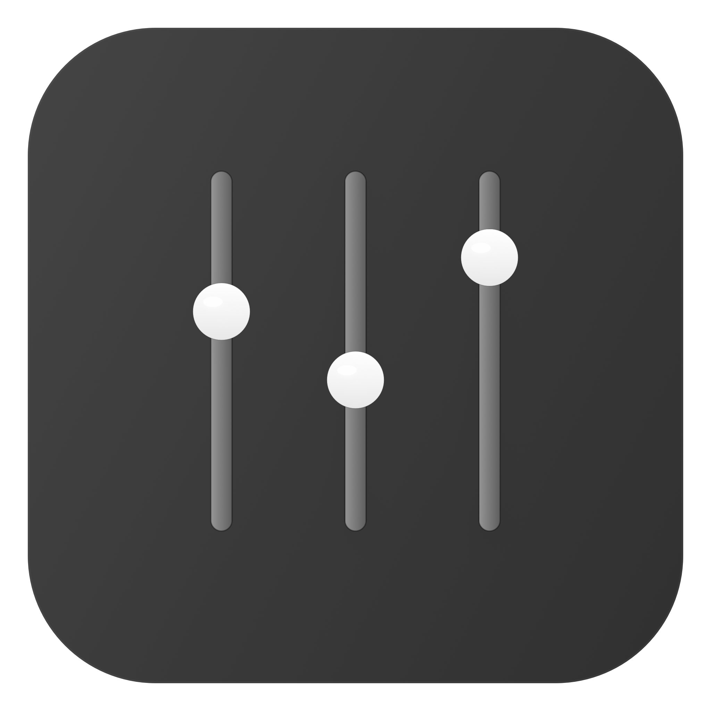
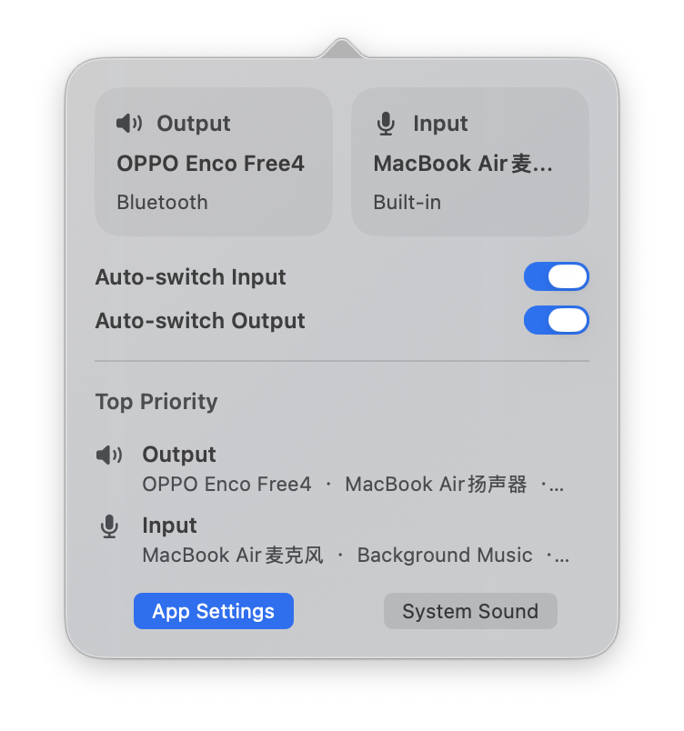
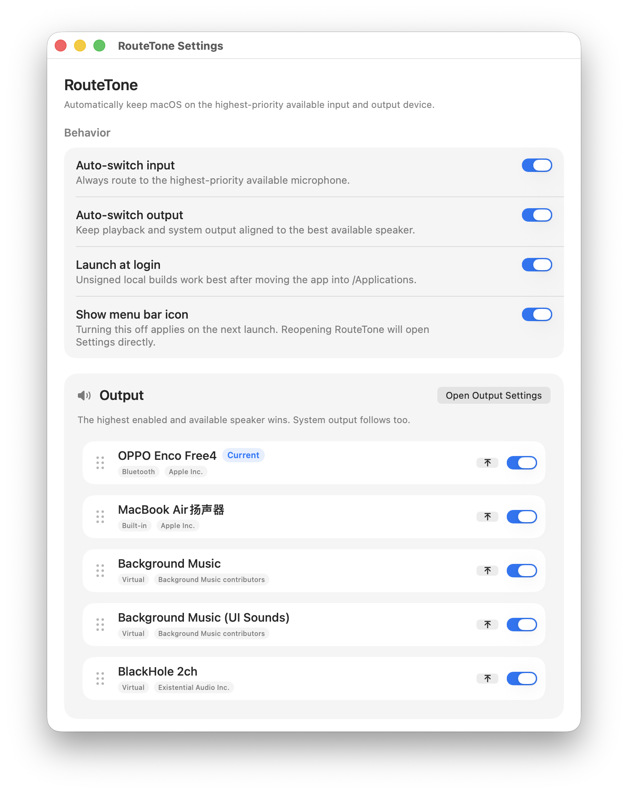

<p align="center">
  
</p>

<h1 align="center">RouteTone</h1>

<p align="center">
  让 MacBook 始终使用正确的输入和输出设备。
</p>

[English](README.md)

RouteTone 用来解决一个很常见的 MacBook 声音问题：  
你一连接 AirPods、显示器、扩展坞、蓝牙耳机或者 USB 设备，macOS 就会把输入或输出切到错误的设备上。

RouteTone 会监听这些变化，然后自动切回你设定的最高优先级设备。

<p align="center">
  
</p>

<p align="center">
  直接在状态栏里查看当前输入输出，并快速开关自动切换。
</p>

<p align="center">
  
</p>

<p align="center">
  为输出和输入分别设置优先级，让 RouteTone 自动帮你保持在正确的设备上。
</p>

## 它能做什么

- 输入和输出分开排序
- 自动选择当前可用且优先级最高的设备
- 支持在设置里拖动排序
- 常驻状态栏，随时可查看和调整

## 安装

### Homebrew

```bash
brew tap kang-0909/tap
brew install --cask routetone
```

### 直接下载

去 GitHub Release 页面下载最新版本，解压后把 `RouteTone.app` 拖到 `/Applications`。

## 怎么用

1. 打开 `App Settings`
2. 在 `Output` 里拖动排序
3. 在 `Input` 里拖动排序
4. 保持 `Auto-switch Input` 和 `Auto-switch Output` 开启

之后只要 macOS 切错设备，RouteTone 就会自动帮你切回来。

## 开发构建

```bash
swift build
./Scripts/build-app.sh
open dist/RouteTone.app
```

## 发布

这个仓库已经带了 GitHub Release 工作流和 Homebrew cask 模板。

- 发布说明：[`RELEASE.md`](RELEASE.md)
- Homebrew cask：[`Casks/routetone.rb`](Casks/routetone.rb)
